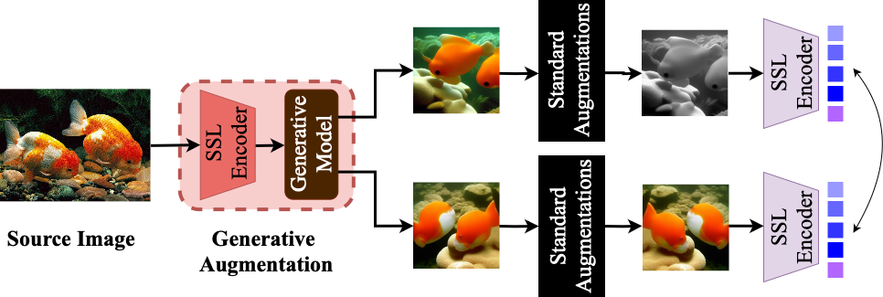

# Generative SSL

This repository contains the PyTorch implementation of **"Can Generative Models Improve Self-Supervised Representation Learning?"** accepted to AAAI 2025.

## Abstract

Self-supervised learning (SSL) holds significant promise in leveraging unlabeled data for learning robust visual representations. However, the limited diversity and quality of existing augmentation techniques constrain SSL performance. We introduce a novel framework that incorporates generative models to produce semantically consistent and diverse augmentations conditioned on source images. This approach enriches SSL training, improving downstream task performance by up to 10\% in Top-1 accuracy across various techniques.

Our augmentation pipeline utilizes generative models, i.e., Stable Diffusion or ICGAN, conditioned on the source image representation, accompanied by the standard SSL augmentations. The components inside the Generative Augmentation module, i.e. the pretrained SSL encoder and the generative model remain frozen throughout the SSL training process.

## Requirements

We used solo-learn library for the implementation of SSL method. You can find the library in this [LINK](https://github.com/vturrisi/solo-learn).

To create the virtual environment for running the experiments please first:

`cd solo-learn`

Then install requirements based on solo-learn library documentation [here](https://github.com/vturrisi/solo-learn?tab=readme-ov-file#installation).

## Data Generation
**Note:** 
**You always need to set the proper path to the virtual environment and path to save generated data in generation scripts.**

To generate augmentations with ICGAN run:

`sbatch GenerativeSSL/scripts/generation_scripts/gen_img_icgan.slrm`

To generate augmentations with Stable Diffusion run:

`sbatch GenerativeSSL/scripts/generation_scripts/gen_img_stablediff.slrm`

## Training and Evaluation 
**Note:** 
**You always need to set the proper path to the virtual environment in solo-learn slrm files. We pretrained our models on train split of Imagenet. Here is the model and dataset choices for the evaluation that we used in our experiments:**

- **Datasets:** ImageNet, iNaturalist2018, Food101, Places365, CIFAR10/100
- **Models:** SimCLR (Baseline, ICGAN, Stablediff), SimSiam (Baseline, ICGAN, Stablediff), MoCo (Baseline, ICGAN, Stablediff), BYOL (Baseline, ICGAN, Stablediff), Barlow Twins (Baseline, ICGAN, Stablediff)

### Training 

Configs for training are in the `solo-learn/scripts/pretrain` folder. You can find the config files for each model and dataset in the respective folders. You need to set **path for the dataset** and **dir to save model** in each respective config file before submitting the job. By choosing the desired config you can train the methods on the ImageNet, run:

`sbatch scripts/solo_learn/train_solo_learn.slrm`

### Evaluation

Configs for evaluation are in the `solo-learn/scripts/linear` folder. You can find the config files for each model and dataset in the respective folders. You need to set **path for the dataset**, **dir to save model** and **path to pretrained feature extractor** in each respective config file before submitting the job. By choosing the desired config you can train the methods on the ImageNet, run:

`sbatch scripts/solo_learn/eval_solo_learn.slrm`
